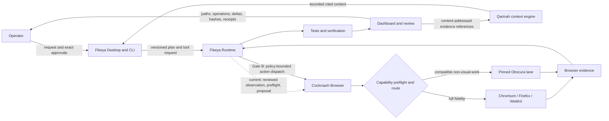

# Fikeya + Cockroach Browser

## A governed, browser-verified coding-agent runtime

**Research and evidence date:** 2026-09-03
**Document status:** Technical and market paper for the current Fikeya beta and Cockroach Browser `v0.5.0-rc.1`

> **Product direction:** From plan to browser-verified patch, with exact approvals and receipts.
>
> Full browsers when fidelity matters. In the pinned Obscura 0.2.1 constrained non-visual fixture, the complete owned browser process tree reached a 28.25 MiB maximum across 20 measured launches.

## Abstract

AI coding agents can read and modify a repository, but a correct-looking patch is not proof that the resulting product works in a browser. Giving a model an unrestricted browser is not an acceptable answer either: ambient authentication, unrestricted origins, hidden network effects, unbounded processes, and unverifiable outcomes turn browser automation into a broad authority grant.

Fikeya and Cockroach Browser address complementary parts of this problem. Fikeya provides the coding workspace, bounded project context, provider-neutral agent loop, exact one-use approvals, file-change accounting, tests, and review. Cockroach Browser provides a governed execution plane over full Chromium, Firefox, and WebKit lanes plus an explicitly scoped lightweight Obscura lane. Qarinah provides cited project memory and evidence references, but it is not an execution authority. The current reviewed Fikeya preset connects to Cockroach Browser for observation, capability preflight, and canonical non-executing action proposals; it deliberately denies direct action dispatch. A single dispatch-and-proof path that binds a Fikeya approval, Cockroach execution, browser evidence, source changes, and tests remains Gate B in this paper.

The current lightweight proof is deliberately narrow and reproducible. In the pinned Obscura 0.2.1 constrained non-visual fixture, the complete runtime-owned browser process tree reached a maximum resident set size of **29,622,272 bytes, exactly 28.25 MiB**, across 20 measured launches. Every required connect, JavaScript, DOM, form, screenshot preflight-denial, and teardown check passed for the 30 MiB target. The Node coordinator was measured separately. This is not a whole-application, arbitrary-page, rendered-page, persistent-session, or full-browser memory guarantee.

The resulting product category is not another rendering engine and not merely another hosted Chrome endpoint. Cockroach Browser is a **governed, local-first, multi-engine browser runtime for AI agents**. Fikeya supplies the coding and review workflow; the current integration is read-and-propose, and the intended complete dispatch-and-proof product is explicitly gated below.

## Evidence convention

This paper separates three kinds of statements:

- **Verified project evidence** refers to current Fikeya repository behavior, the Cockroach Browser `v0.5.0-rc.1` release, or retained benchmark artifacts and tests.
- **Vendor-reported evidence** refers to capabilities, benchmarks, pricing, or customer outcomes published by another product's official documentation or repository. It is useful market evidence, but it is not independent validation.
- **Recommendation** refers to product, engineering, distribution, or business priorities proposed here. A recommendation is not presented as a shipped capability.

Competitor capabilities and market conditions are time-sensitive. Recheck linked primary sources before publishing an external comparison.

## 1. The problem

Browser automation has matured into several strong layers:

1. automation frameworks such as Playwright, Puppeteer, and Selenium;
2. managed browser fleets such as Browserless and Browserbase;
3. agent abstractions such as Stagehand;
4. open browser APIs and infrastructure such as Steel;
5. lightweight, machine-oriented engines such as Lightpanda and Obscura.

These products establish a high baseline for browser compatibility, sessions, profiles, tracing, extraction, screenshots, PDFs, proxies, and agent control. They do not remove the need for an application-level authority boundary that answers:

- Which origin may this agent open?
- Which effects may it cause there?
- Which exact action did a person approve?
- Which browser or engine can safely perform the requested capability?
- What resource and time budgets apply to the owned process tree?
- What code changed, and what browser evidence verifies the change?
- Which context informed the decision, and did that context incorrectly become permission?
- Can another operator reproduce the result from retained evidence?

Fikeya's opportunity is to make those questions part of the default coding-agent workflow rather than an afterthought added around a generic browser session.

## 2. System architecture

The following is the target reference architecture. The current preset reaches Cockroach Browser's observation and proposal surfaces; the action-dispatch branch is not yet a shipped Fikeya integration.



### 2.1 Fikeya: orchestration and review

Fikeya is the product surface in which a person asks, plans, builds, reviews, and researches. Its current architecture supplies:

- provider-neutral agent execution and provider-reported usage receipts;
- a reviewed plan-act-observe-review loop;
- exact **Allow Once**, **Deny Once**, and **Cancel Run** decisions for requested tools;
- bounded workspace reads, atomic publication with stale-context hashes for file writes, and test/process requests;
- approval-gated built-in browser verification plus separately reviewed external MCP presets;
- a dashboard that can report exact changed paths, `add`/`edit`/`delete` operations, before/after byte counts, exact lines added and deleted when available, and before/after SHA-256 identities;
- content-free request, response, provider, runtime, and Qarinah receipts;
- local project and usage views without invented token, cost, or sample-graph data.

The repository's detailed boundaries remain authoritative in [Fikeya architecture](https://github.com/AjnasNB/fikeya/blob/main/docs/fikeya/ARCHITECTURE.md), [plan-to-proof](https://github.com/AjnasNB/fikeya/blob/main/docs/fikeya/PLAN_TO_PROOF.md), and [security](https://github.com/AjnasNB/fikeya/blob/main/docs/fikeya/SECURITY.md).

The file-write precondition rejects a stale measured hash and an unmeasured concurrent create immediately before publication. It is optimistic concurrency control, not an operating-system transaction with every external editor: an uncooperative writer can still alter an existing file in the final check-to-replace interval. Operators should save edits before approval and avoid parallel writers on an approved target; closing that residual interval with a platform-backed compare-and-swap protocol is a release-hardening item.

### 2.2 Cockroach Browser: governed execution

Cockroach Browser is not a new rendering engine. It routes work to a selected engine and adds a contract above it:

- per-action capability manifests with `supported`, `experimental`, `unsupported`, or adapter-dependent states;
- explicit engine selection and no silent downgrade when a requested action is unavailable;
- origin, effect, approval, resource, evidence, and lifecycle controls;
- complete owned-process-tree measurement and bounded termination semantics;
- content-addressed evidence and action receipts;
- local, customer-controlled operation with reviewed provider adapters;
- compatibility surfaces for established browser protocols and libraries.

The verified `v0.5.0-rc.1` release reports 130 source-derived capabilities: 119 available and 11 adapter-dependent, with none represented merely as planned. It includes exercised Chromium, Firefox, and WebKit headed/headless paths; pinned Playwright Core 1.62.1 and Puppeteer Core 25.5.0 exports; code generation; CDP, BiDi, WebDriver, and Appium surfaces; events, locators, assertions, network rewriting, WebSockets, HAR, coverage, heap, tracing, screencast, profiling, emulation contracts, a finite agent, and a model gateway. See the [official release](https://github.com/AjnasNB/cockroach-browser/releases/tag/v0.5.0-rc.1). Fikeya's reviewed preset accepts the compatible prerelease range `>=0.5.0-rc.1 <0.6.0`; the benchmark and capability evidence cited in this paper are pinned specifically to `v0.5.0-rc.1`.

### 2.3 Qarinah: context and evidence memory

Qarinah compiles compact, cited project context from approved project evidence. It may help an agent understand prior decisions, tool outcomes, symbols, tests, or related receipts. It cannot grant browser origins, effects, credentials, filesystem access, process execution, or additional budget.

This is a core invariant:

> **Memory may inform a decision; memory never expands authority.**

Fikeya must continue to request current, exact authorization even when Qarinah contains evidence of a similar prior action.

### 2.4 Engine lanes

The routing model has two intentionally different lanes:

| Lane | Appropriate work | Required behavior |
| --- | --- | --- |
| Full-browser lane | visual assertions, layout, screenshots, PDF fidelity, extensions, complex media, cross-browser QA, and sites requiring complete browser behavior | Route to Chromium, Firefox, or WebKit and expose the selected engine in evidence. |
| Lightweight lane | compatible DOM, JavaScript, forms, navigation, extraction, and other explicitly supported non-visual work | Preflight every requested capability, require explicit opt-in for experimental behavior, and reject unsupported work before launch. |

The lightweight lane is an optimization, not a substitute for browser fidelity. Routing must remain visible in the plan, receipt, and review UI.

## 3. Authority model

The browser boundary assumes that the model, the page, external content, and remote services may all be incorrect or adversarial. Authority belongs to the operator and to explicit policy, not to model confidence.

### 3.1 Principals and trust boundaries

| Principal | May provide | Must not implicitly receive |
| --- | --- | --- |
| Operator | task, workspace selection, provider selection, exact approval, allowed origin/effect, budget | undisclosed external side effects or broader approval than shown |
| Model provider | proposed plan, code, tool arguments, interpretation | ambient credentials, unrestricted host access, hidden prior response bodies, or authority derived from project memory |
| Fikeya Runtime | schema validation, policy checks, tool brokering, file/test receipts | permission to bypass an approval or silently widen a tool request |
| Cockroach Browser | browser lifecycle, routing, resource enforcement, action/evidence receipts | arbitrary origins, effects, profiles, proxies, or unsupported capability fallback |
| Web page | DOM, scripts, network responses, downloadable content | instruction priority, secrets, host filesystem access, or permission to invoke another tool |
| Qarinah | bounded cited context and evidence references | action authority, secrets, tool execution, or automatic approval |
| External adapter | a specifically configured proxy, challenge, hosted browser, mobile, or identity capability | representation as a Fikeya-operated service when Fikeya only supplies an adapter contract |

### 3.2 Target decision sequence

Today, the Fikeya Cockroach preset ends after preflight and a canonical proposal. Steps 6-10 describe the Gate B dispatch-and-proof integration and must not be represented as already shipped.

1. Fikeya compiles the user's request and bounded cited context.
2. A provider proposes a plan or a concrete action.
3. The runtime validates the action against schema, workspace, origin, effect, and resource policy.
4. Fikeya displays the exact one-use request to the operator when approval is required.
5. Cockroach Browser preflights the selected engine and capability state.
6. The runtime launches only the approved route and tracks the owned lifecycle.
7. The selected browser executes the bounded action.
8. Tests and browser assertions verify the result.
9. The dashboard reports outcomes, changed files, test evidence, resource observations, and receipts.
10. Qarinah may record content-addressed evidence references after execution; a pre-execution approval is never presented as proof of success.

### 3.3 Security boundary

The current external executable and policy broker are meaningful controls, but they are not a complete hostile-content sandbox. Strong OS or container isolation, protocol-complete egress enforcement, and broader hostile-page testing are next release gates. Until those gates pass, documentation must not claim complete isolation or containment of all network paths.

## 4. Current verified component and integration envelope

### 4.1 What is connected today

The current product can credibly present the following verified component capabilities and read-and-propose integration:

- build or review a code change through Fikeya's provider-neutral agent runtime;
- compile bounded, cited Qarinah context without converting it into permission;
- require an exact one-use approval for Fikeya-owned workspace, process, and built-in browser effects;
- enable and launch a reviewed Cockroach Browser MCP preset rather than an arbitrary MCP executable;
- inspect Cockroach capabilities, engines, preflight results, health, authorized sessions, snapshots, captures, network records, and audits;
- prepare a canonical Cockroach action proposal without dispatching it;
- inspect Cockroach Browser's versioned, checksummed `v0.5.0-rc.1` release manifest and retained reports for its documented Playwright, Puppeteer, CDP, BiDi, WebDriver, MCP, Chromium, Firefox, WebKit, and pinned Obscura surfaces;
- record changed path, operation, before/after size, line additions/deletions when exact, and SHA-256 identities;
- retain test outcomes, provider-reported usage when supplied, Qarinah evidence references, and browser/action receipts;
- expose unsupported or external-service-dependent capabilities instead of inventing a local implementation.

These components form a stronger story together than any individual checkbox, but their presence is not evidence of a completed combined dispatch path. Playwright compatibility, MCP, browser screenshots, or an agent loop are market parity. The differentiated product contract will be the tested connection between code, authority, engine routing, verification, and evidence; Gate B defines the evidence required before using that as a shipped-capability claim.

### 4.2 Explicit external-service boundaries

The current release does not operate a hosted global browser cloud, residential proxy inventory, captcha-solving service, Safari/mobile device lab, or hosted live-session viewer. Cockroach Browser may expose adapter contracts for some of these capabilities. An adapter contract is not an operated service and must not be marketed as one.

No product claim should promise covert evasion, undetectability, universal site access, or captcha bypass.

## 5. The exact 28.25 MiB result

The canonical record is [Obscura non-visual memory proof: 2026-09-03](https://github.com/AjnasNB/cockroach-browser/blob/v0.5.0-rc.1/docs/benchmarks/obscura-non-visual-2026-09-03.md).

### 5.1 Result

| Field | Recorded value |
| --- | --- |
| Cockroach release | `v0.5.0-rc.1` |
| Lightweight engine | Obscura 0.2.1 |
| Resource profile | `constrained` |
| Workload | one runtime-owned loopback CDP server and one non-visual data-URL document |
| Runs | one warmup plus 20 measured launches |
| Required operations | connect, JavaScript evaluation, DOM query, text input, and HTML element click dispatch |
| Required checks | connect, JavaScript, DOM, forms, screenshot preflight denial, and teardown |
| 30 MiB target | 31,457,280 bytes |
| Maximum browser-tree RSS | **29,622,272 bytes = exactly 28.25 MiB** |
| Per-launch peak distribution | minimum 28,893,184; median 29,347,840; p95 29,569,024; maximum 29,622,272 bytes |
| Observations | 478 retained process-tree observations for the 30 MiB run |
| Platform | Windows x64, 16 logical CPUs, AMD Ryzen 7 4800H, 16,557,887,488 bytes total memory, Node 24.15.0 |
| Verdict | all required capability checks and all 30 MiB memory observations passed |

The measurement aggregates RSS for the complete runtime-owned browser process tree from spawn through startup, CDP connection, workload, settling, and shutdown preparation. It retains boundary observations and ten required steady-state samples at 25 ms intervals for each measured launch. The source tree, runtime build, benchmark harness, executable, and retained result artifacts have recorded SHA-256 identities, making later mutation detectable.

### 5.2 What the number does and does not mean

`MiB` means 1,048,576 bytes. The exact maximum is 28.25 MiB; it is approximately 29.62 decimal MB. Public copy must retain the binary unit or state the raw bytes.

The measurement includes:

- the complete runtime-owned browser process tree;
- startup, connection, the specified non-visual workload, steady-state sampling, and shutdown preparation;
- the pinned executable and recorded test environment.

The measurement excludes from the 28.25 MiB number:

- the Node coordinator, which is measured separately in the artifact;
- Fikeya Desktop and the rest of the application;
- arbitrary public pages;
- rendered-page fidelity or screenshots;
- persistent or attached sessions;
- Chromium, Firefox, and WebKit.

The public supported result is the measured **30 MiB PASS** above. Marketing must keep the exact 28.25 MiB value, raw-byte value, fixture, process-tree scope, launch count, and exclusions together; it must not round that evidence into a broader “28 MB or less” promise.

### 5.3 Reproduction

The Cockroach repository verifies checked-in artifacts, narrative bindings, and current source/build identity with:

```powershell
npm run verify:lightweight-proof
```

A new benchmark run is new evidence and must not overwrite an immutable prior record. Reproduction requires the recorded source and executable identities, the constrained profile, one warmup, 20 measured iterations, ten resource samples per iteration, and a 25 ms sample interval.

## 6. Market landscape by product layer

A useful comparison must not treat a framework, browser engine, hosted fleet, and governance layer as interchangeable products.

| Product and layer | Officially documented capability | Market implication for Fikeya + Cockroach |
| --- | --- | --- |
| [Playwright](https://playwright.dev/) — automation and testing framework | One API for Chromium, Firefox, and WebKit; TypeScript, Python, .NET, and Java; auto-waiting, resilient locators, isolated contexts, parallel execution, code generation, and trace inspection. Its [Trace Viewer](https://playwright.dev/docs/trace-viewer) correlates actions with DOM snapshots, source, console, and network evidence. | Three engines, code generation, traces, and MCP are parity. Preserve compatibility and add the governed plan-to-proof layer above it. |
| [Puppeteer](https://pptr.dev/guides/what-is-puppeteer) — browser automation library | Chrome and Firefox control through CDP or WebDriver BiDi, with headless/headful automation, forms, UI tests, screenshots, crawling, and prerendering. Its [BiDi documentation](https://pptr.dev/next/webdriver-bidi) explains that Firefox uses BiDi and that tracing, coverage, CDP sessions, and extension APIs remain unsupported there; Chrome still defaults to CDP where BiDi coverage is incomplete. | Raw Puppeteer, CDP, screenshots, PDFs, and BiDi are compatibility requirements, but support must be stated per browser and protocol. |
| [Selenium WebDriver](https://www.selenium.dev/documentation/webdriver/) — standards-oriented automation | W3C WebDriver for local or remote native browser control. [WebDriver BiDi](https://www.selenium.dev/documentation/webdriver/bidi/) adds bidirectional events, while [Selenium Grid](https://www.selenium.dev/documentation/grid/getting_started/) distributes sessions across machines. | Enterprise QA expects standards, language breadth, remote execution, security guidance, and measurable Grid operations. Maintain protocol interoperability and document supported subsets exactly. |
| [Browserless](https://docs.browserless.io/) — managed and self-hosted browser infrastructure | Playwright/Puppeteer/CDP WebSocket endpoints plus APIs for screenshots, PDFs, content, and functions; BrowserQL, profiles, downloads, reconnect, crawl, live URLs, proxies, captcha handling, and stealth-oriented services. See its [API overview](https://docs.browserless.io/open-api/overview) and [connection endpoints](https://docs.browserless.io/overview/connection-urls). | Browserless sets a strong onboarding and infrastructure baseline. Fikeya should not compete first on browser hours; it should make local governance, code linkage, and evidence easier to adopt. |
| [Browserbase](https://docs.browserbase.com/platform/browser/observability/observability) and [Stagehand](https://github.com/browserbase/stagehand) — hosted fleet and agent abstraction | Browserbase provides live view, recordings, console/network observability, identities, sessions, proxies, and concurrency. Stagehand adds Playwright-style `act`, `observe`, and `extract`, self-healing, accessibility-context trimming, iframe/shadow-root handling, and telemetry. | This is the strongest integrated commercial reference for browser agents. Fikeya's honest distinction is customer-controlled execution plus exact authority and proof, not larger managed scale. |
| [Steel](https://docs.steel.dev/) — open browser API and managed infrastructure | Open-source and managed operation with Playwright, Puppeteer, Selenium, CDP, sessions, profiles, storage, extensions, proxies, captcha handling, stealth/fingerprint options, debug UI, logs, extraction, screenshots, and PDFs. See the [official repository](https://github.com/steel-dev/steel-browser) and [profile API](https://docs.steel.dev/overview/profiles-api/overview). | Open source, self-hosting, profiles, and an agent-facing browser API are parity. Enforcement, engine-aware preflight, and code-linked receipts must carry Fikeya's message. |
| [Lightpanda](https://github.com/lightpanda-io/browser) — lightweight browser engine | A Zig-built, non-Chromium engine with CDP, native MCP, and deterministic PandaScript. Its vendor [benchmark methodology](https://lightpanda.io/docs/core-concepts/benchmarks) reports substantial speed and memory improvements for its exact workloads. Its [architecture documentation](https://lightpanda.io/docs/core-concepts/architecture-overview) also states that it lacks a full rendering engine, uses placeholder screenshots, and approximates geometry. | Low memory, AI-native operation, and MCP are not exclusive. Full/light routing and a governed evidence contract are more defensible than an unqualified engine-performance claim. |
| [Obscura](https://github.com/h4ckf0r0day/obscura) — lightweight browser engine | An Apache-2.0 Rust/V8 engine with a CDP subset, Playwright/Puppeteer compatibility, rendering, screenshot, screencast, PDF, cookies, iframes, proxy support, MCP, and default private-network denial. The [0.2.1 release](https://github.com/h4ckf0r0day/obscura/releases/tag/v0.2.1) records iframe, MCP queue, rendering, network, cookie, SPA, stealth-fidelity, and security work. Long-tail CSS, Web APIs, media, compositor, and font behavior continue to differ from Chromium. | Obscura is Cockroach Browser's upstream lightweight engine. Claim the pinned integration, policy, routing, and independently retained project measurement—not invention of the engine or full-browser parity. |
| [Cockroach Browser `v0.5.0-rc.1`](https://github.com/AjnasNB/cockroach-browser/releases/tag/v0.5.0-rc.1) — governed multi-engine execution | Capability negotiation, full/light routing, origins/effects/approvals/budgets, owned-process lifecycle, receipts, and compatibility across established frameworks and protocols. | This is the browser execution layer of the combined product. It should interoperate with the framework ecosystem instead of replacing it. |
| Fikeya — coding-agent orchestration and proof | Provider-neutral code workflow, bounded Qarinah context, exact approvals, file/test/browser evidence, and review inside the coding workspace. | The initial wedge is a browser-verified coding agent, not a generic headless-browser endpoint. |

The market also demonstrates that the model-facing tool surface matters. Lightpanda's vendor agent benchmark reports different results from different tool layers over the same engine, while Stagehand and Browserless emphasize compact semantic operations and batching. The product should expose a small, stable, semantic tool set to agents while retaining full Playwright/Puppeteer/CDP surfaces for deterministic programs and expert operators.

## 7. Target users and jobs to be done

### 7.1 Primary beachhead: browser-verified software agents

**Users:** teams building coding agents, autonomous engineering systems, preview-environment testing, internal developer platforms, and AI-assisted QA.

**Jobs:**

- verify the interface produced by a code change rather than stopping at compilation;
- test preview deployments across full browser engines;
- connect a browser error to the exact source change and test outcome;
- run several bounded verification sessions without leaking profiles or leaving orphan processes;
- attach inspectable evidence to a task, patch, review, or pull request;
- reproduce why an agent considered work complete.

Browserbase's vendor case study for General Intelligence Company describes a comparable demand pattern: agents create pull requests, deploy previews, test them in browser sessions, and retain video evidence. The reported outcome is vendor/customer-supplied rather than independent, but the workflow validates the job category. See the [case study](https://www.browserbase.com/blog/case-study-general-intelligence-company).

### 7.2 Regulated and authenticated operations

**Users:** healthcare, financial, tax, compliance, benefits, and other teams automating signed-in portals under audit and data-residency constraints.

**Jobs:**

- preserve an approved identity without exposing unrestricted credentials to the model;
- pause for human login, multifactor authentication, or a sensitive effect;
- prove which origin and action were authorized;
- retain evidence without persisting raw secrets or provider response bodies;
- operate inside customer-controlled infrastructure.

Official Browserbase customer stories include healthcare claims, compliance, tax, disability, and benefits workflows; Browserless publishes financial and retirement automation cases. These are vendor-reported examples, not independent outcome studies. See [Browserbase customer stories](https://www.browserbase.com/customer-stories) and [Browserless customer stories](https://www.browserless.io/customers).

### 7.3 Data extraction and operational intelligence

**Users:** teams performing JavaScript-heavy extraction, monitoring, research, price intelligence, or structured web operations.

**Jobs:**

- use the lightweight lane where the requested DOM work is compatible;
- route visual or unsupported tasks to a full browser before execution;
- control concurrency and resource budgets;
- produce structured results with source and action provenance;
- integrate an operator-selected proxy or challenge provider when required.

### 7.4 Workflow automation and low-code integrations

**Users:** internal tools, support, sales operations, logistics, and n8n-style workflow builders.

**Jobs:**

- invoke a small REST or MCP surface;
- reuse authenticated profiles safely;
- combine browser actions with webhooks and approval steps;
- inspect a replay or receipt when an unattended run needs review.

### 7.5 Not the initial wedge

The first launch should not target consumer browsing, the cheapest commodity Chrome hour, an operated global proxy network, or universal anti-bot bypass. Those categories require different capital, operations, risk, and support models and do not use Fikeya's strongest integrated advantages.

## 8. Product priorities: next release gates

### Gate A: five-minute activation

**Outcome:** a new user can install Fikeya and Cockroach Browser, enable the reviewed preset, run one browser-verified code change, and inspect the receipt without editing configuration manually.

**Acceptance evidence:** clean Windows, macOS, Linux, and supported ARM runs; signed packages; captured median time to first successful verified session; repeatable uninstall; no global dependency assumption.

### Gate B: permanent combined end-to-end proof

**Outcome:** CI exercises one complete path from a Fikeya request and exact approval through Cockroach MCP/browser activity, code change, tests, file evidence, dashboard rendering, and Qarinah capture.

**Acceptance evidence:** deterministic fixture, negative-policy cases, artifact hashes, and a reproducible command documented in the repository.

### Gate C: local session inspection

**Outcome:** the operator can inspect browser actions, screenshots or DOM evidence as applicable, console/network events, selected engine, policy decisions, resource observations, and links to tests and changed files.

**Acceptance evidence:** replay or trace fixture, bounded storage, redaction tests, source correlation, and exportable content-addressed evidence.

### Gate D: profiles and human handoff

**Outcome:** persistent authentication can be scoped to an identity and origin, and a person can take over for credentials or multifactor steps before returning control to the agent.

**Acceptance evidence:** profile-isolation tests, credential redaction, dedicated origin rules, takeover timeout, and no profile reuse without explicit policy.

### Gate E: compact agent-native browser tools

**Outcome:** models receive stable high-level `observe`, `act`, `extract`, capability-preflight, evidence, and session operations with batching and bounded output, while programmatic users retain low-level compatibility.

**Acceptance evidence:** public schemas, deterministic reference fixtures, token/step measurements, iframe/shadow-root cases, bounded retries, and policy-respecting self-healing tests.

### Gate F: hardened containment

**Outcome:** hostile pages execute inside an OS/container isolation backend with enforceable egress and process limits.

**Acceptance evidence:** SSRF, redirects, DNS rebinding, private networks, WebSockets, service workers, downloads, path traversal, prompt injection, secret redaction, crash, hang, and process-orphan tests.

### Gate G: durable fleet and adapter operations

**Outcome:** queues, quotas, concurrency admission, cost/resource routing, and configured external providers behave predictably under load.

**Acceptance evidence:** 1/10/25/50/100-session results, saturation behavior, reconnect tests, tenant isolation, usage receipts, and explicit distinction between native and provider-operated features.

## 9. Reproducible evaluation plan

Every published result should identify source, build, harness, browser binary, dependencies, machine, configuration, workload, sampling method, and raw artifacts. Passed gates and known bounds should be published together; changing the environment creates a new result.

### 9.1 Correctness and contract conformance

- Exercise every declared action against its schema and capability state.
- Verify that unsupported actions reject before engine launch.
- Verify that experimental actions require explicit opt-in.
- Test deterministic navigation, DOM, forms, frames, shadow roots, events, downloads/uploads, cookies/storage, network interception, WebSockets, screenshots, PDFs, and traces where supported.
- Retain per-engine pass, unsupported, and adapter-dependent matrices.

### 9.2 Real-page compatibility

- Maintain deterministic local fixtures for regression and at least 100 documented public pages for compatibility observation.
- Stratify pages by static content, SPA, forms, frames, authentication, downloads, shadow DOM, media, and visual fidelity.
- Record engine, route, version, timestamp, action result, failure taxonomy, and evidence hash.
- Never represent a lightweight-engine pass on a DOM task as full rendering compatibility.

### 9.3 Resource and performance measurements

- Compare exact pinned versions on the same host and workload.
- Report browser-process-tree RSS and PSS separately where the platform supports them.
- Report coordinator overhead separately.
- Measure startup, task latency, CPU time, peak memory, throughput, and teardown.
- Run fresh launch, warmed session, rendered page, authenticated session, and persistent-session tracks.
- Evaluate concurrency at 1, 10, 25, 50, and 100 sessions with admission and saturation behavior disclosed.
- Do not convert CPU time into energy or watts without a calibrated energy counter.

### 9.4 Reliability

- Run a minimum 24-hour soak and thousands of bounded launches.
- Inject browser crashes, protocol disconnects, timeouts, malformed responses, partial downloads, and coordinator termination.
- Classify every crash, hang, forced termination, and unexplained owned-process orphan.
- Report memory-growth slope and teardown-verification state.

### 9.5 Agent-task evaluation

- Use a public benchmark where licensing permits and a deterministic in-repository task suite.
- Compare the compact semantic tools, raw Playwright/CDP access, and alternative routing policies over the same engine and model.
- Report success rate, cost, latency, step count, retries, policy denials, human interventions, and failure category.
- Pin model and prompt versions; do not attribute a tool-layer result solely to the browser engine.

### 9.6 Security negative suite

- Test SSRF, redirect chains, DNS rebinding, IPv4/IPv6 private targets, WebSockets, service workers, and secondary resource fetches.
- Test prompt injection, malicious accessibility text, deceptive forms, download filenames, filesystem paths, extension messages, and oversized output.
- Test credential, cookie, authorization-header, provider-response, console, screenshot, and error-message redaction.
- Verify token, approval, profile, origin, effect, duration, and resource scope under replay and reconnect.

### 9.7 Human-control evaluation

- Measure whether users can correctly identify the requested origin, effect, file scope, engine, identity, and budget before approving.
- Record abandonment, accidental denial, unsafe approval, and time-to-decision without storing sensitive request bodies in analytics.
- Test that prior approvals and Qarinah memories never preselect authority for a new action.

### 9.8 Release and supply-chain evaluation

- Build signed, platform-targeted artifacts from pinned dependencies.
- Generate checksums, SBOMs, provenance, and artifact attestations.
- Reopen every package to verify allowlisted contents and absence of secrets, caches, project state, and development-only files.
- Repeat install, first run, update verification, rollback behavior, and uninstall on clean hosts.

## 10. Distribution and ninety-day go-to-market

### 10.1 Canonical product-led demo

The launch demonstration should be executable in less than five minutes:

1. open a sample application in Fikeya;
2. request a visible UI change;
3. inspect the proposed plan and exact approval;
4. apply the patch;
5. start the preview and select the appropriate Cockroach engine lane;
6. verify the result in a full browser, with lightweight routing demonstrated separately where compatible;
7. inspect the exact changed path, operation, line and byte deltas, before/after hashes, test result, browser evidence, and Qarinah receipt.

This is the product's proof loop. A generic “take a screenshot” demo would hide the differentiated value.

### 10.2 Product distribution

- Publish the CLI and SDK through npm using [trusted publishing](https://docs.npmjs.com/trusted-publishers/) and provenance.
- Publish signed GitHub releases with checksums, SBOMs, and [artifact attestations](https://docs.github.com/en/actions/how-tos/secure-your-work/use-artifact-attestations/use-artifact-attestations).
- Publish versioned GHCR and Docker images.
- Submit the reviewed server to the [official MCP Registry](https://modelcontextprotocol.io/registry/quickstart).
- Publish the Desktop extension as VSIX and through [Open VSX](https://github.com/eclipse-openvsx/openvsx/wiki/Publishing-Extensions) after clean-host gates pass.
- Add Homebrew, Scoop, or winget only after signed binary releases are repeatable.
- Maintain runnable TypeScript and Python quickstarts plus templates for browser-verified pull requests, authenticated human handoff, governed extraction, and lightweight-to-full routing.
- Publish integration examples for Browser Use, LangChain, CrewAI, Mastra, n8n, GitHub Actions, and leading MCP clients.

### 10.3 Audience distribution

- GitHub releases, Discussions, issues, and a public compatibility/evidence changelog;
- a benchmark page with raw artifacts, hashes, environment, and exact reproduction command;
- one comprehensive paper supported by shorter architecture, benchmark, security, and integration articles;
- direct design-partner outreach to coding-agent, preview-testing, healthcare, fintech, compliance, and private-agent teams;
- browser automation, developer tooling, local AI, QA, and agent-framework communities;
- Show HN and Product Hunt after the clean install and complete demo work without maintainer intervention.

### 10.4 Days 0–30: truth and activation

- Reconcile version, capability count, benchmark scope, limitations, and commands across the repository, site, package metadata, and demo.
- Complete the five-minute activation and combined end-to-end gates.
- Ship four runnable examples for the primary jobs.
- Sign packages and verify clean install/uninstall on supported hosts.
- Recruit 5–10 design partners in browser-verified engineering and regulated portal automation.
- Capture installation completion and time-to-first-verified-session data.

### 10.5 Days 31–60: evidence and integration

- Publish the per-engine compatibility matrix and stable failure taxonomy.
- Run same-host pinned comparisons, real-page compatibility, concurrency, soak, fault-injection, and agent-task tracks.
- Ship at least three verified framework or workflow integrations.
- Add session inspection, profile isolation, and human handoff to design-partner workflows.
- Turn repeated onboarding and runtime problems into release gates and public documentation.

### 10.6 Days 61–90: public release

- Publish this paper with raw evidence and reproduction instructions.
- Cut a release candidate, repeat cross-platform clean-host and security verification, and publish stable artifacts when the gates pass.
- Launch around the runnable plan-to-proof demo and the exact scoped benchmark rather than an unsupported superiority claim.
- Maintain a public evidence changelog and respond to reproducible issues with test fixtures.
- Keep any hosted service as a waitlist until tenancy isolation, support boundaries, capacity, operational cost, and reliability are measured.

## 11. Business model

The near-term economic value is governed execution, private deployment, reproducible evidence, and integration support—not undifferentiated browser hours.

### 11.1 Open adoption layer

- local Fikeya and Cockroach workflows;
- core SDK, CLI, reviewed MCP preset, and compatibility surface;
- reproducible benchmark and public evaluation fixtures;
- community templates and framework integrations.

### 11.2 Commercial layer

- enterprise support and long-term-support releases;
- signed and certified enterprise builds;
- private deployment and upgrade assistance;
- organization policy packs and evidence exports;
- administrative controls, SSO/SCIM, role-based approvals, profile governance, and retention policy;
- validated external-provider connectors;
- priority compatibility and incident support.

### 11.3 Hosted service gate

A hosted browser product should launch only after the team has measured multi-tenant isolation, regional operations, concurrency limits, browser-minute cost, storage/egress, abuse controls, support load, and service-level objectives. Until then, provider adapters may help customers use an existing hosted fleet without implying that Fikeya operates it.

Cockroach Browser's AGPL-3.0-or-later licensing requires an explicit business decision: remain pure copyleft, or introduce a separately reviewed commercial/dual-license offer. Enterprise buyers should not have to infer the intended licensing model.

## 12. Key performance indicators

### Activation

- clean-install completion rate;
- median and p95 time to first verified browser session;
- percentage of users completing the canonical plan-to-proof demo;
- preset enablement and engine-download completion;
- onboarding failure rate by step and platform.

### Product value

- weekly active projects and four-week retained projects;
- browser-verified coding runs per active project;
- percentage of completed changes with reproducible browser and test evidence;
- exact changed-file receipt coverage;
- successful tasks by job, engine, site class, and action type;
- human takeover completion for authenticated workflows.

### Reliability and governance

- policy-preflight rejection accuracy;
- rate of actions executed without the required exact approval, with a target of zero;
- resource-limit enforcement rate;
- crash, hang, forced-termination, and unexplained orphan rate;
- trace/receipt reproduction rate;
- profile-isolation and redaction test pass rate;
- median issue time to resolution for reproducible failures.

### Efficiency

- task latency, provider-reported token usage, and browser resource cost per verified outcome;
- percentage of eligible tasks safely routed to the lightweight lane;
- fallback rate from lightweight to full browser, separated into preflight and runtime causes;
- concurrency achieved at each resource budget.

### Business

- design-partner activation and retained usage;
- open-source install-to-active-project conversion;
- active-project-to-supported-deployment conversion;
- support effort and gross margin by deployment type;
- expansion through additional projects, profiles, policies, and integrations.

## 13. Claim boundaries

| Topic | Approved language | Language not supported by current evidence |
| --- | --- | --- |
| Category | “A governed, local-first, multi-engine browser runtime for AI agents.” | “A completely new browser engine.” |
| Current integration | “Fikeya's reviewed Cockroach preset exposes bounded observation, capability preflight, and canonical non-executing action proposals.” | Any claim that the current preset dispatches Cockroach browser actions. |
| Combined value after Gate B | “From plan to browser-verified patch, with exact approvals and receipts.” | This line as a shipped-capability claim before the permanent combined end-to-end gate passes; “the only AI browser”; or “better than every browser.” |
| Memory | “The pinned Obscura 0.2.1 constrained non-visual fixture reached a maximum complete owned-browser-process-tree RSS of 29,622,272 bytes, exactly 28.25 MiB, across 20 measured launches and passed the 30 MiB target.” | “28 MB or less,” “a 28 MB app,” “every feature in 28 MB,” or “all pages use 28 MB.” |
| Scope | “The Node coordinator was measured separately; this is not a whole-app, arbitrary-page, rendered-page, persistent-session, or full-browser guarantee.” | Any copy that omits this scope while implying a general application memory ceiling. |
| Routing | “Use the lightweight lane for explicitly compatible DOM/JavaScript work and full browsers when fidelity matters.” | “The lightweight lane replaces Chromium” or “full browser compatibility.” |
| Capability | “The selected engine is preflighted and unsupported work is rejected before launch.” | Universal support, silent fallback, or an adapter-dependent feature presented as native. |
| Compatibility | “Compatible with established Playwright, Puppeteer, CDP, BiDi, WebDriver, and MCP surfaces within the documented release envelope.” | “Drop-in for every version and every API” without a matching compatibility matrix. |
| Security | “Origins, effects, approvals, resources, evidence, and lifecycle are policy-controlled.” | “Complete sandbox,” “all egress contained,” “unhackable,” or hostile-content isolation beyond tested boundaries. |
| Web access | “Operator-selected proxy, identity, challenge, and hosted-browser providers can be integrated through explicit adapters.” | “Undetectable,” “unblockable,” “works on every site,” or “bypasses captchas.” |
| Services | “Local/customer-controlled execution with provider adapter contracts.” | Claims of operated global regions, residential proxies, captcha solving, mobile/Safari lab, or hosted live viewer before those services exist. |
| Market | “The governance and code-linked evidence combination is the product's differentiated position.” | “First,” “only,” or universal exclusivity without a defined dated comparison set. |
| Outcomes | Measured project benchmarks and explicitly authorized design-partner statements. | Invented customers, savings, reliability, compliance, adoption, or benchmark leadership. |

## 14. Positioning and homepage order after Gate B

Recommended lead after the combined dispatch-and-proof acceptance evidence is published:

> **One governed browser runtime for coding agents.**
>
> Build a change in Fikeya, verify it through Cockroach Browser, and inspect the exact approvals, engine route, changed files, tests, and evidence behind the result.

Recommended browser proof line:

> **Full browsers when fidelity matters. The pinned Obscura 0.2.1 constrained non-visual fixture reached a 28.25 MiB maximum complete owned-browser-process-tree RSS across 20 measured launches.**

Recommended feature order:

1. the plan-to-browser-to-proof workflow;
2. a runnable five-minute demo;
3. exact approvals and the memory-is-not-authority boundary;
4. changed paths, operations, line/byte deltas, hashes, tests, and receipts;
5. Chromium, Firefox, WebKit, and the scoped lightweight lane;
6. capability preflight and explicit routing;
7. Playwright, Puppeteer, CDP, BiDi, WebDriver, and MCP compatibility;
8. local/customer-controlled deployment;
9. reproducible 28.25 MiB proof with visible scope;
10. current service boundaries and next release gates.

## Conclusion

Fikeya and Cockroach Browser should win on a complete, inspectable outcome: an agent can understand a project, propose a change, receive exact authority, operate the appropriate browser, verify the result, and return evidence that connects browser behavior to source changes and tests. The current components and read-and-propose preset are the foundation; Gate B is the proof required to call that full sequence shipped.

The market already supplies excellent automation frameworks, hosted fleets, agent abstractions, and lightweight engines. Fikeya should embrace that ecosystem and make its own layer unmistakable: governed execution, visible routing, bounded context, exact file evidence, and reproducible proof inside the coding workflow.

The current 28.25 MiB result is strong because it is exact and scoped. The same discipline should govern every claim that follows. Product leadership will come from repeatedly converting next release gates into verified capabilities—not from turning one benchmark into a promise it did not measure.

## Primary-source reference index

### Project sources

- [Fikeya README](https://github.com/AjnasNB/fikeya/blob/main/README.md)
- [Fikeya architecture](https://github.com/AjnasNB/fikeya/blob/main/docs/fikeya/ARCHITECTURE.md)
- [Fikeya plan-to-proof](https://github.com/AjnasNB/fikeya/blob/main/docs/fikeya/PLAN_TO_PROOF.md)
- [Fikeya security](https://github.com/AjnasNB/fikeya/blob/main/docs/fikeya/SECURITY.md)
- [Cockroach Browser repository](https://github.com/AjnasNB/cockroach-browser)
- [Cockroach Browser `v0.5.0-rc.1`](https://github.com/AjnasNB/cockroach-browser/releases/tag/v0.5.0-rc.1)
- [Canonical 28.25 MiB proof](https://github.com/AjnasNB/cockroach-browser/blob/v0.5.0-rc.1/docs/benchmarks/obscura-non-visual-2026-09-03.md)
- [Cockroach Browser market positioning](https://github.com/AjnasNB/cockroach-browser/blob/v0.5.0-rc.1/docs/market-positioning.md)
- [Cockroach Browser white paper](https://github.com/AjnasNB/cockroach-browser/blob/v0.5.0-rc.1/docs/whitepaper.md)

### Market and technical sources

- [Playwright](https://playwright.dev/)
- [Playwright Trace Viewer](https://playwright.dev/docs/trace-viewer)
- [Puppeteer](https://pptr.dev/guides/what-is-puppeteer)
- [Puppeteer WebDriver BiDi](https://pptr.dev/next/webdriver-bidi)
- [Selenium WebDriver](https://www.selenium.dev/documentation/webdriver/)
- [Selenium WebDriver BiDi](https://www.selenium.dev/documentation/webdriver/bidi/)
- [Selenium Grid](https://www.selenium.dev/documentation/grid/getting_started/)
- [Browserless documentation](https://docs.browserless.io/)
- [Browserless API overview](https://docs.browserless.io/open-api/overview)
- [Browserbase observability](https://docs.browserbase.com/platform/browser/observability/observability)
- [Browserbase customer stories](https://www.browserbase.com/customer-stories)
- [Stagehand repository](https://github.com/browserbase/stagehand)
- [Steel documentation](https://docs.steel.dev/)
- [Steel repository](https://github.com/steel-dev/steel-browser)
- [Lightpanda repository](https://github.com/lightpanda-io/browser)
- [Lightpanda benchmark methodology](https://lightpanda.io/docs/core-concepts/benchmarks)
- [Lightpanda architecture](https://lightpanda.io/docs/core-concepts/architecture-overview)
- [Obscura repository](https://github.com/h4ckf0r0day/obscura)
- [Obscura 0.2.1 release](https://github.com/h4ckf0r0day/obscura/releases/tag/v0.2.1)

### Distribution sources

- [npm trusted publishing](https://docs.npmjs.com/trusted-publishers/)
- [GitHub artifact attestations](https://docs.github.com/en/actions/how-tos/secure-your-work/use-artifact-attestations/use-artifact-attestations)
- [MCP Registry quickstart](https://modelcontextprotocol.io/registry/quickstart)
- [Open VSX publishing](https://github.com/eclipse-openvsx/openvsx/wiki/Publishing-Extensions)
